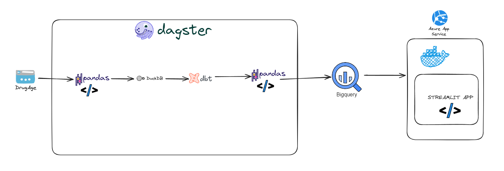
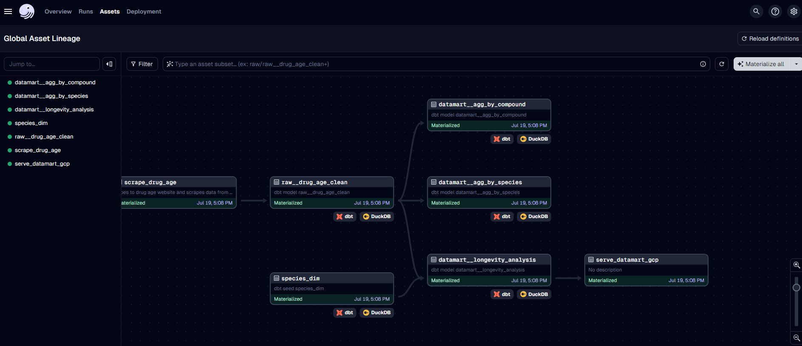

# DrugAge Explorer: Longevity Compound Analysis Pipeline

## Project Overview

DrugAge Explorer is a comprehensive data engineering project that processes and visualizes data from the DrugAge database, focusing on compounds that affect lifespan in model organisms. This project demonstrates a full-stack data pipeline, from web scraping to data visualization, all orchestrated by Dagster.

### Key Features

- 🕷️ Web Scraping: Extracts data from genomics.senescence.info
- 🗃️ Data Storage: Utilizes DuckDB for efficient data handling
- 🧹 Data Transformation: Employs dbt for data cleaning and modeling
- ☁️ Cloud Integration: Loads data into Google BigQuery
- 📊 Data Visualization: Presents insights through a Streamlit app
- 🐳 Containerization: Dockerized for easy deployment
- ☁️ Cloud Hosting: Deployed on Azure App Service
- 🎭 Orchestration: Managed end-to-end with Dagster

## Architecture

1. **Orchestration**: Dagster manages the entire data pipeline flow.
2. **Data Extraction**: Python scripts with Selenium scrape the DrugAge database.
3. **Local Storage**: Raw data is stored in DuckDB for initial processing.
4. **Data Transformation**: dbt models clean and transform the data.
5. **Cloud Storage**: Processed data is loaded into Google BigQuery.
6. **Visualization**: A Streamlit app queries BigQuery and presents interactive visualizations.
7. **Deployment**: The app is containerized with Docker and hosted on Azure App Service.

## Technologies Used

- Dagster (Orchestration)
- Python
- Selenium
- DuckDB
- dbt
- Google BigQuery
- Streamlit
- Docker
- Azure App Service

## Dagster Workflow

Dagster orchestrates our entire data pipeline, providing:
- Asset-based data orchestration
- Dependency management between tasks
- Scheduling and triggering of data updates
- Monitoring and alerting
- Data lineage and observability

## Getting Started

To run it locally: 
1. Clone repo.
2. Create virtual enviornment with `python -m venv ./.venv`
3. Activate venv with `./.venv/Scripts/activate`
4. Install requirements via `pip install -r requirements.txt`
5. In the longevity-drugs folder, create a new folder "duckdb_database". This is where the duckdb database will be made.
6. in terminal, cd to longevity-drugs. Run `dagster dev`
7. The dagster webserver should be running now on `localhost:3000`
8. Can see a global view of the DAG in "Assets".
9. For the final node in the dag to run (load to google big query), you would need to set up a GCP account and project. Then follow [this documentation](https://docs.dagster.io/integrations/bigquery/using-bigquery-with-dagster#option-1-using-the-bigquery-resource). 

